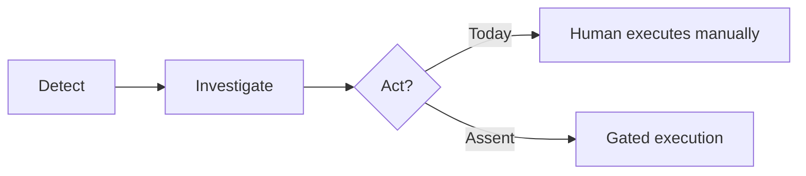
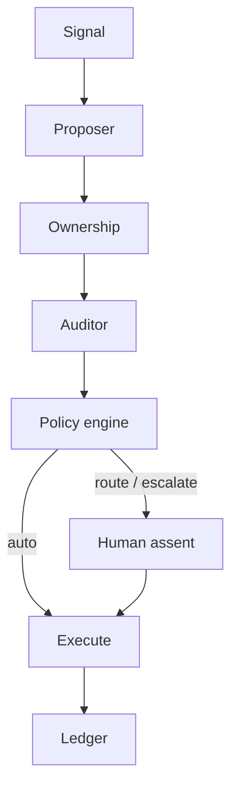
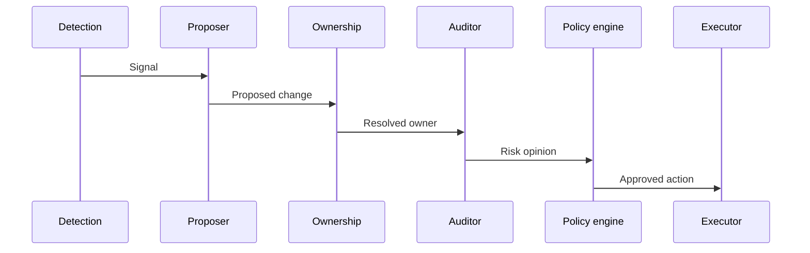
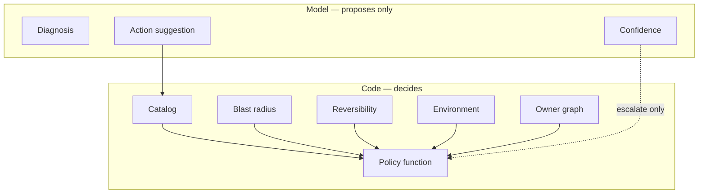
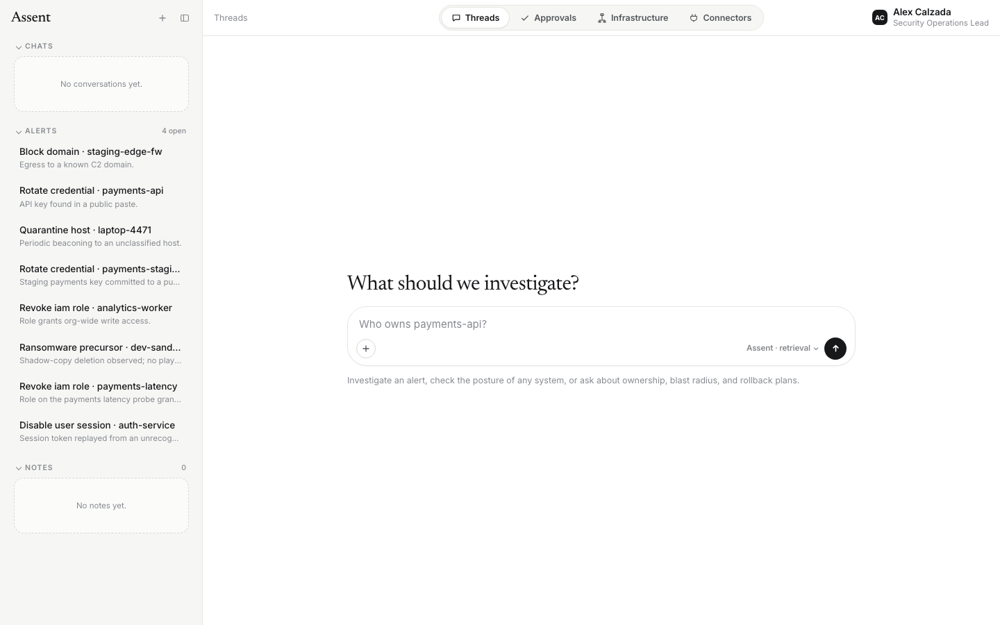
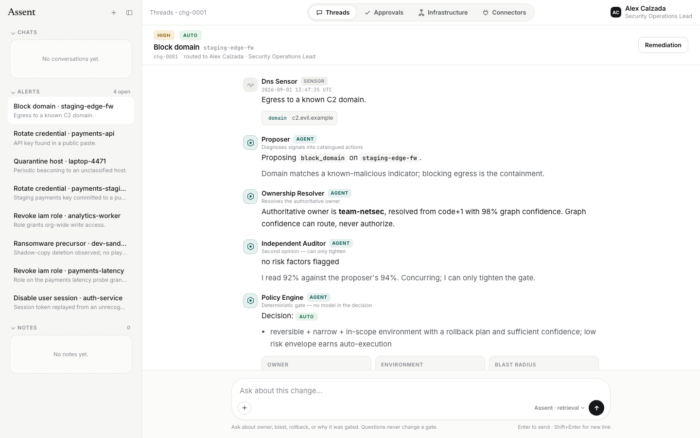
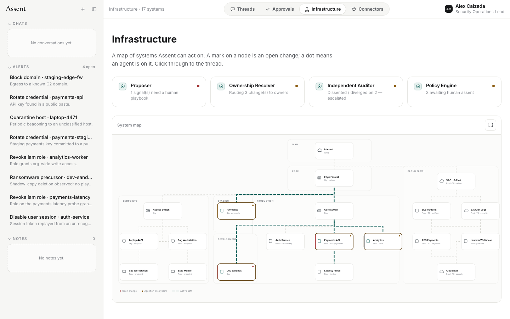
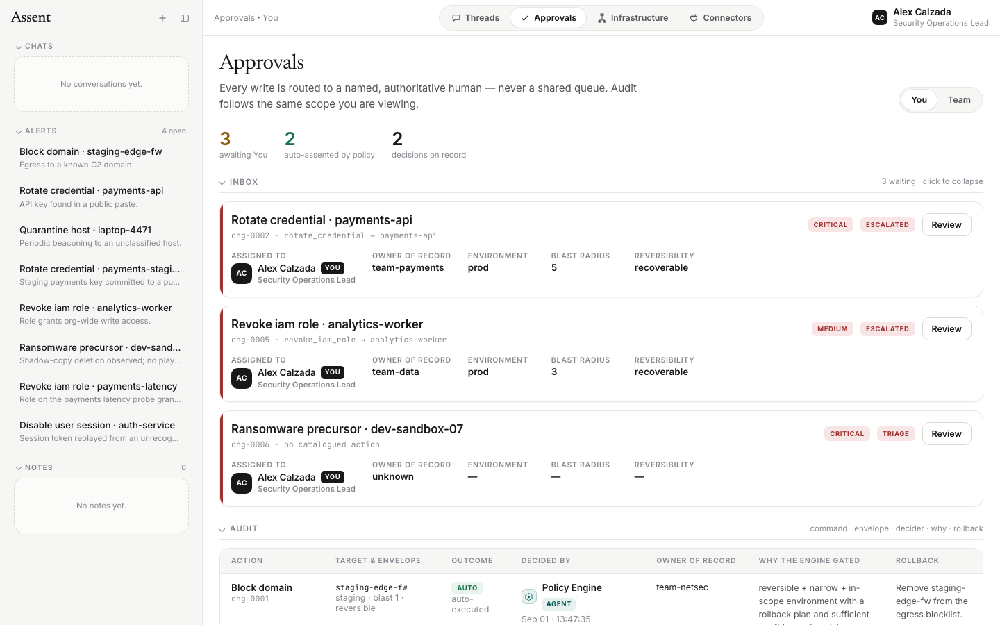
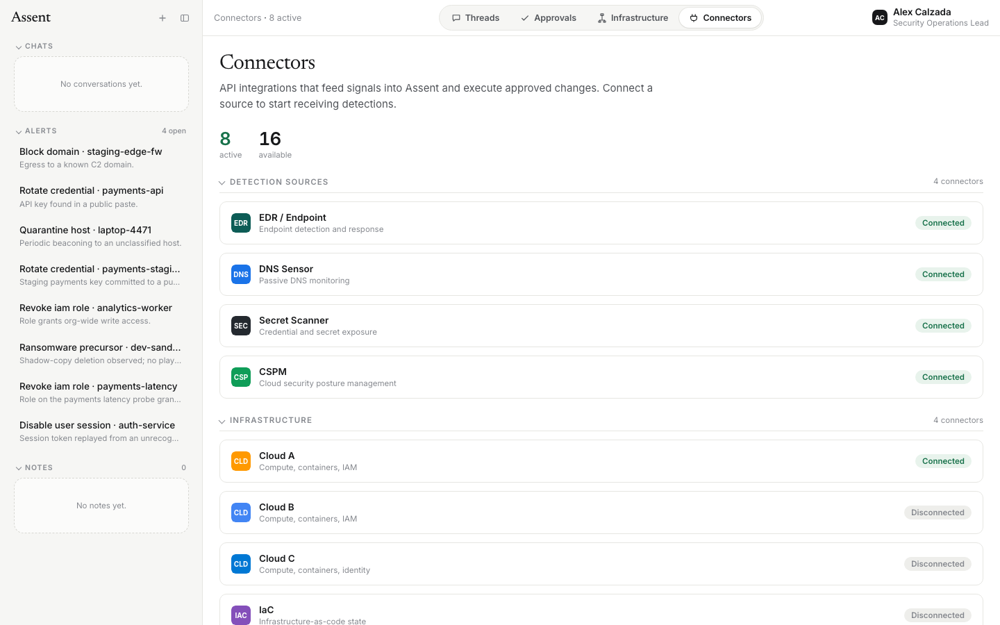

# Assent

**A control plane for safe agentic security defense.**

Investigation tools tell you what is wrong. Assent decides **who may act**, under
**what risk envelope**, and **with what rollback**. Nothing acts without
**assent** — earned by policy or given by a named human owner.

**Alex Calzada** · Copyright © 2026 · see [LICENSE](LICENSE)

> This public repository documents the concept and shows the control plane.
> The working implementation is private.

---

## Summary

Security operations can investigate at scale but rarely **act** at scale. The
blocker is trust — not model capability.

For every proposed change, Assent computes a deterministic gate:

| Decision | When |
|---|---|
| **Auto-execute** | Low risk envelope: reversible, narrow, non-prod |
| **Route to owner** | Gate held until the authoritative owner assents |
| **Escalate** | Missing owner, audit dissent, or fail-safe |

The LLM **proposes** and **explains**. Deterministic code **authorizes**.
Confidence can only tighten the gate — it never opens it.

---

## Problem



| Risk | Why it blocks autonomy |
|---|---|
| Wrong auto-fix | Incorrect target or action |
| Over-privilege | Standing write access |
| False confidence | Model certainty ≠ safety |
| Poisoned context | Untrusted data as instructions |
| Missing owner | Generic approval queues |

Most agentic security tooling stops at detection or read-only investigation.
Assent is the **control layer** between those signals and real enforcement: it
does not replace your firewall, SOAR, or cloud IAM — it decides whether an
action is safe enough to hand off, and to whom.

---

## Design

### Change primitive

Everything the system reasons about reduces to one object:

```
Change {
  action        → catalogued command + target
  risk_envelope → blast_radius × reversibility × environment
  owner         → authoritative stack owner
  rollback      → undo plan
}

PolicyEngine(envelope, owner) → auto | route | escalate
```

The action **catalog** is the safety boundary: agents can only propose commands
that exist in the catalog. Blast radius, environment, and reversibility come
from inventory and action type — not from model opinion.

### Invariants

1. Gate on **risk-to-act**, not threat severity
2. LLM **outside** the trust decision
3. Confidence **escalates only** — never authorizes
4. Every write requires a **rollback plan**
5. **Independent audit** — dissent triggers escalation
6. Incomplete data → **ask a human**

---

## Architecture



A signal enters from a connector (DNS, EDR, scanner, etc.). The **Proposer**
maps it to a catalogued action. **Ownership** resolves who is authoritative for
the affected stack. An **Independent Auditor** gives a second opinion that can
only tighten the gate. The **Policy engine** is a pure function — no model in
the decision. Approved actions execute through a gateway; every step is written
to a tamper-evident **ledger**.



### Trust boundary



When an LLM is attached, the model can propose actions and answer questions in
thread. When it is not, the prototype runs fully offline with rule-based
proposals and retrieval-backed answers. Either way, the gate is computed by
deterministic code.

---

## Control plane

The reference UI is a single-page control plane. Four top-level surfaces map to
how security teams actually work: investigate in **Threads**, assent in
**Approvals**, orient on **Infrastructure**, and wire sources in **Connectors**.

| Surface | Purpose |
|---|---|
| **Threads** | Alerts as conversations — each thread is one proposed change with full agent context |
| **Approvals** | Inbox for writes that need a named human; audit log for every decision |
| **Infrastructure** | Topology map of systems, zones, and open changes |
| **Connectors** | Detection sources and enforcement hand-off points |

### Threads — investigate and ask

The home view opens to an empty composer. Open alerts sit in the sidebar; you
can click one to open its thread or type a free-form question about posture,
ownership, blast radius, or rollback.



*The sidebar lists open alerts (each is a `Change` waiting on a gate). The
composer accepts natural-language questions. With an API key, answers use the
LLM; without one, retrieval over the incident package still works.*

### Alert thread — agents in the open

Each alert thread shows the full pipeline as a conversation: sensor detection →
Proposer → Ownership Resolver → Independent Auditor → Policy Engine. You see
exactly what was proposed, who owns the stack, whether audit agreed, and the
final gate decision (`AUTO`, `ROUTE`, or `ESCALATE`). A remediation card at the
top summarizes the proposed action; approve/deny/undo controls live in the
thread header.



*Example: a DNS sensor flags egress to `c2.evil.example`. The Proposer suggests
`block_domain` on `staging-edge-fw`. Ownership resolves to `team-netsec`. Audit
concurs. Policy auto-executes because the action is reversible, narrow, and
in-scope — with a rollback plan on record.*

### Infrastructure — where changes land

The infrastructure map lays out your environment by zone (WAN, edge, cloud,
endpoints, staging, production, development). Each node is a system in the
inventory with environment, tier, and owner metadata. **Open changes** are
marked on affected nodes; **active paths** highlight connections involved in
pending work; a dot shows when an agent is operating on a system. Agent status
cards at the top summarize what each machine role is doing across the fleet.



*Thicker dashed lines are active paths for open changes. The red bar on a node
means a change is pending there. Expand the map full-screen from the corner
control when the topology is dense.*

### Approvals — named humans, not queues

Writes that do not earn auto-execution land in an approval inbox scoped to
**you** or your **team**. Each card shows severity, gate reason, owner,
environment, blast radius, and reversibility. The audit table below records
every decision — who assented, why the engine gated, and what rollback applies.



*Three changes await human assent (credential rotation, IAM revoke, ransomware
triage with unknown owner). Two were auto-executed by policy. The audit row for
`chg-0001` shows the engine's reasoning and rollback instructions.*

### Connectors — signals in, actions out

Connectors are the integration surface: detection sources feed signals in;
enforcement gateways execute approved changes out. The prototype ships with a
catalog of connector types (EDR, DNS, CSPM, cloud inventory, scanners, action
gateway) to show how a deployment would be wired.



---

## What the prototype includes

| Layer | Role |
|---|---|
| Policy engine | Pure function: `(envelope, owner) → gate` |
| Ownership graph | Resolves authoritative owner from corroborated claims |
| Audit agent | Second opinion; dissent escalates |
| Approval card | Renders a gated `Change` from real engine output |
| LLM layer (optional) | Proposer + chat; offline fallback when no API key |
| Dashboard | Control plane UI with threads, approvals, infrastructure map, connectors |
| Test suite | 105 tests on engine, graph, audit, ledger, and UI routes |

The demo world uses synthetic inventory, signals, and team personas so you can
click through the full loop locally.

---

## Intellectual property

This repository is published to document the Assent concept and establish
authorship. **All rights reserved.** No commercial use, redistribution, or
derivative products without permission. See [LICENSE](LICENSE).

For licensing inquiries, contact the repository owner.
